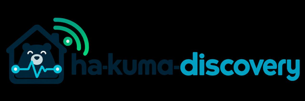

# HA Kuma Discovery



Home Assistant devices and infrastructure mirrored to Uptime Kuma.

Current version: **2.2.1**. Based on the original 1.5.1 add-on. Supports amd64 and aarch64.

## Installation

Add this repository in the Home Assistant app/add-on store:

```text
https://github.com/holsteiner-kiel/ha-kuma-discovery
```

Install **HA Kuma Discovery**, set `kuma_url`, `kuma_username` and `kuma_password` in its configuration, then start it and check its logs. Home Assistant Supervisor is required.

[Add repository to Home Assistant](https://my.home-assistant.io/redirect/supervisor_addon_repository/?repository_url=https%3A%2F%2Fgithub.com%2Fholsteiner-kiel%2Fha-kuma-discovery)

## Existing local installation

Keep a backup of the existing add-on configuration and data. A repository installation has a different add-on identity from a local installation; settings and `/data/state.json` are not migrated automatically. Stop the local copy before starting the repository copy, and verify the resulting Kuma monitors before removing the old installation.

## Version 2.2.1

Home Connect Local appliances use their own configured local host for Ping. If
an appliance is also available through Home Connect Cloud, the Local monitor
wins. Cloud-only appliances use their enabled native Connectivity binary sensor
as a Push monitor.

Ecovacs devices use only their enabled native **IP Address** diagnostic entity
for Ping. Enable that entity in Home Assistant to monitor the device; use
`ecovacs_ignore` to silence intentionally unmonitorable devices. Device IPs are
never resolved through UniFi, FRITZ! or other unrelated integrations.

## Version 2.2.0

With the default settings, every successfully evaluated Push monitor sends its current state each cycle. Kuma retains its 180-second heartbeat window and DOWN requires three consecutive unavailable cycles. Recovery is reported immediately.

Version 2.2.0 keeps the stable link between each Home Assistant source and its
managed Kuma monitor. Later device or app/add-on renames update the same monitor
instead of creating a duplicate. Existing installations learn these links from
their current monitor names during the first successful sync. Configuration and
monitoring behavior remain compatible. See the changelog for details.

- [Configuration and operation](ha_kuma_discovery/DOCS.md)
- [Changelog](ha_kuma_discovery/CHANGELOG.md)

## Validation

GitHub Actions runs 108 automated tests plus Python compilation, shell syntax,
YAML metadata and native amd64/aarch64 container builds. These checks do not
replace testing inside Home Assistant with a running Uptime Kuma instance.

## License

Licensed under the [MIT License](LICENSE).
