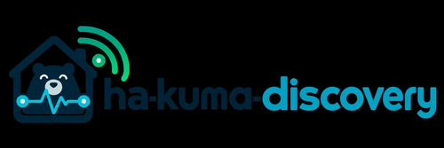

# HA Kuma Discovery 2.2.3

Automatic Home Assistant device discovery for Uptime Kuma.

Version 2.2.3 uses Hue's native Zigbee Connectivity diagnostic sensor for
physical Hue-device liveness.

See [documentation](DOCS.md) for setup, updates and troubleshooting, and
[changelog](CHANGELOG.md) for version history.

## License

Licensed under the [MIT License](../LICENSE).
